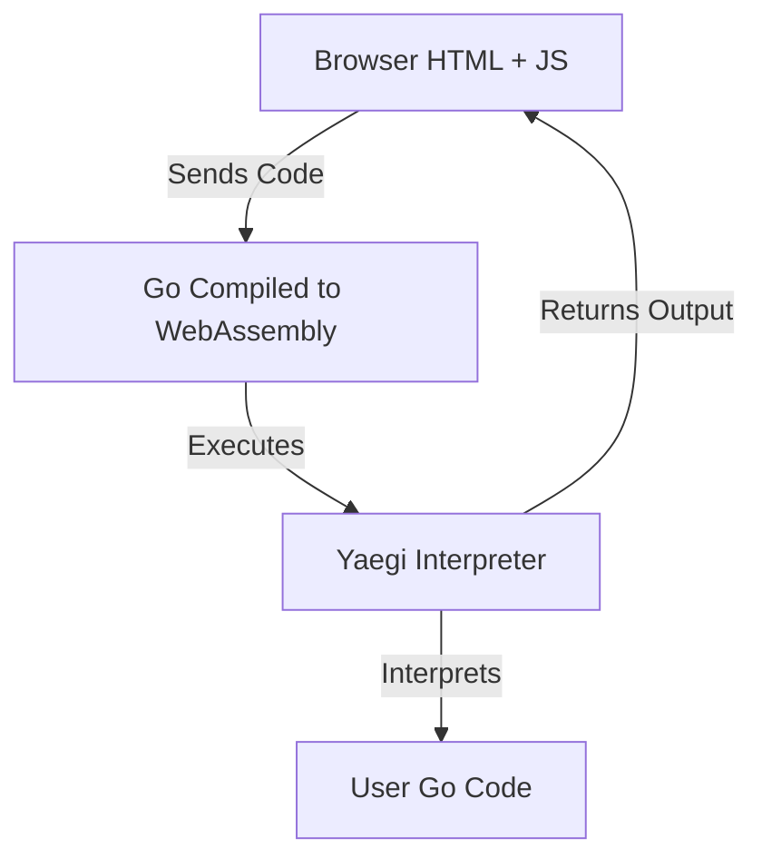

# Go Browser Interpreter (WASM + Yaegi)

Run Go code directly in your browser using WebAssembly and the Yaegi interpreter.
**No backend. No server. Just Go + WASM.**

## What is this?

This project lets you:

* Type Go code in a web page
* Click **Run**
* See the output instantly

**Everything runs inside the browser.**

## How does it work? (Simple)



1. **JavaScript** sends Go code to WebAssembly.
2. **Go** uses Yaegi to interpret that code.
3. **Output** is sent back to JavaScript.

## Project Structure

```text
.
├── main.go        # Go → WASM + Yaegi interpreter
├── main.wasm      # Compiled WebAssembly file
├── index.html     # Web page UI
├── style.css      # Styling
├── wasm_exec.js   # Go WASM runtime (required)
├── go.mod         # Dependencies
└── README.md      # This file

```

## How to run it

### 1. Requirements

* Go 1.22+
* A modern browser
* A local web server (Python, Node, etc.)

### 2. Build the WASM file

```bash
GOOS=js GOARCH=wasm go build -o main.wasm main.go

```

> **Pro Tip:** To make the file smaller (production build), add flags:
> `GOOS=js GOARCH=wasm go build -ldflags="-s -w" -o main.wasm main.go`

### 3. Copy WASM runtime

```bash
cp "$(go env GOROOT)/misc/wasm/wasm_exec.js" .

```

### 4. Start a server

Using Python 3:

```bash
python3 -m http.server 8080

```

**Open:** [http://localhost:8080](https://www.google.com/search?q=http://localhost:8080)

---

## Credits

* **Go Team** — WebAssembly support
* **Traefik Labs** — Yaegi interpreter
