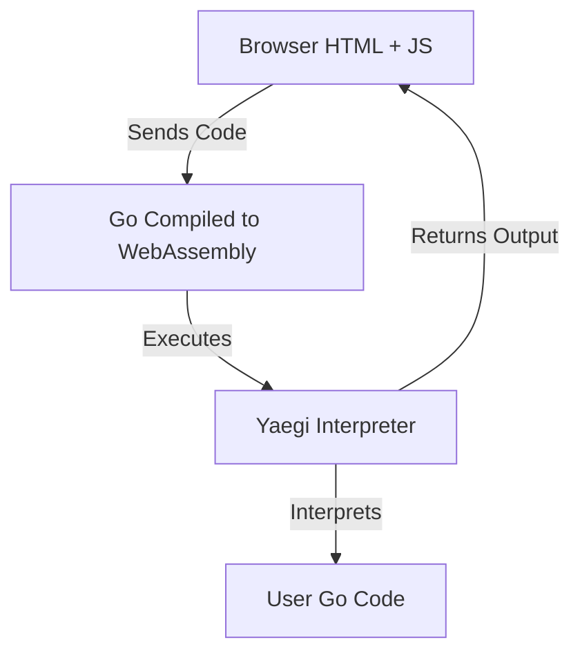

# Go Browser Interpreter (WASM + Yaegi)

Run Go code **directly in your browser** using **WebAssembly**, **Yaegi**, and the **Monaco Editor** (VS Code editor).

**No backend. No server logic. Just Go + WASM.**

## What is this?

This project is a **client-side Go playground** that lets you:

*  Write Go code in a real code editor (Monaco / VS Code)
*  Run the code instantly
*  See output in a terminal-like panel

**Everything runs inside the browser.**

No data is sent anywhere.

## How does it work? (Conceptual)



1. **JavaScript** collects Go code from the Monaco Editor.
2. **Go (compiled to WASM)** receives the code.
3. **Yaegi** interprets and executes the Go code.
4. **Output** is sent back and displayed in the browser.

## Features

### Editor (Monaco)

* Go syntax highlighting
* Line numbers & auto-indent
* Dark theme
* Auto-focus on load
* Ctrl + Enter / Cmd + Enter to run
* Same editor used by VS Code

### Runtime

* Runs fully in the browser (WASM)
* Real Go execution via Yaegi
* Real goroutines & channels (no fake scheduler)
* Supports goroutines, channels, maps, slices, functions

## Known Limitations (Expected)

This is **not** the official Go Playground. By design:

*  No networking (HTTP / TCP disabled)
*  No file system access (WASM sandbox)
*  No fake time acceleration (time.Sleep behaves normally)

These are **browser + WASM limitations**, not bugs.

## Project Structure

```text
.
├── main.go        # Go → WASM + Yaegi interpreter
├── main.wasm      # Compiled WebAssembly binary
├── index.html     # UI + Monaco Editor + JS glue
├── style.css      # Page styling
├── wasm_exec.js   # Go WASM runtime (required)
├── go.mod         # Go module & dependencies
└── README.md      # This file
```

## How to Run Locally

### 1. Requirements

* Go 1.22+
* A modern browser (Chrome, Firefox, Edge)
* A local web server

### 2. Build the WASM file

```bash
GOOS=js GOARCH=wasm go build -o main.wasm main.go
```

**Optional (smaller build):**

```bash
GOOS=js GOARCH=wasm go build -ldflags="-s -w" -o main.wasm main.go
```

### 3. Copy Go WASM runtime

```bash
cp "$(go env GOROOT)/misc/wasm/wasm_exec.js" .
```

### 4. Start a local server

Using Python:

```bash
python3 -m http.server 8080
```

Open in browser:

 [http://localhost:8080](http://localhost:8080)

## Credits

* **Go Team** — WebAssembly support
* **Traefik Labs** — Yaegi interpreter
* **Microsoft** — Monaco Editor
  
